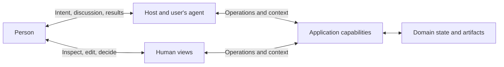

# Application model

An application exposes domain capabilities to an agent that acts in the user's work. This document describes the product model. It does not prescribe an internal service architecture.

## Product forms

| Form | What the product supplies | Typical access | State and responsibility |
| --- | --- | --- | --- |
| Local tool | A capability installed in a working environment | CLI, SDK, files, local MCP | Local computation, files, and declared effects |
| Remote service | A shared or hosted domain capability | HTTP, remote MCP, a CLI or SDK client | Domain records, access controls, remote effects |
| Delegated work | A service that carries out continuing work | Work creation, input, status, and artifact operations | Execution ownership, decisions, interruption, delivery |
| Interactive application | Objects people inspect, edit, and decide on | Operations plus standalone or embedded views | Shared domain facts and human-agent handoffs |

These forms can overlap. They are not maturity levels. A local image converter can satisfy the specification without accounts, a server, or a task queue. A service that publishes reports may need all four forms.

An application may internally use an agent. That choice does not change its obligation to expose clear effects, state, and results.

## Responsibilities

The arrows represent use and information flow. They do not require a shared database, a particular deployment, or an extra middleware layer.

| Participant | Responsibility |
| --- | --- |
| Person | Purposes, participation, and decisions that remain with them |
| Host and user's agent | Interpret intent, select and compose capabilities, manage the conversation, and apply host policy |
| Application | Enforce its domain rules and access policy; maintain the facts and effects it owns |
| Human views | Present relevant facts and support direct participation through domain operations |

For an agent service, the application also owns the execution it accepts. Internal delegation must preserve the scope and traceability of that work. It cannot expand a user's grant merely by passing the task onward.

## The full use cycle

| Stage | The caller's question | The application's contribution |
| --- | --- | --- |
| Discover | Can this product help? | Identity, purpose, scope, entry points |
| Understand | What does this capability mean? | Terms, contracts, examples, limits |
| Connect | Can I use it in this environment? | Installation or connection guidance, versions, access requirements |
| Read context | What exists and what is current? | Search, relevant objects, relationships, revisions |
| Act | What input is needed and what will change? | Validated operations with declared effects |
| Follow | Was it accepted, completed, or blocked? | Results or continuing work state and updates |
| Examine | What changed and how can I check? | Artifacts, evidence, uncertainty, views |
| Correct | What can change now? | Edits, decisions, cancellation, recovery, takeover |
| Leave | What happens when I disconnect? | Retention, exports, access revocation, disposition of active work |

Stages can repeat or overlap. A synchronous calculation can complete several in one call. A long task can require several decisions. The application needs only the mechanisms its supported work requires.

## Five parts of a usable product

1. **Product description:** identity, purpose, supported work, limits, and access conditions.
2. **Capability contracts:** operations and resources with clear structure and meaning.
3. **Methods:** examples and optional Skills for common goals and exceptions.
4. **State and evidence:** readable facts about ongoing work and its effects.
5. **Presentation and participation:** ways to inspect results and make human contributions.

These are responsibilities, not mandatory files or services. A small CLI can carry most of them in help and output. A remote service can link several resources from one entry point.

## Discovery at three scopes

**Product discovery** finds a candidate application. A registry, a search result, an installed package, or a user-provided link can be enough.

**Capability discovery** finds operations within a known application. Examples include subcommand help, an API description, or MCP tool listing.

**Current applicability** concerns the caller and the object: authority, revision, state, and prerequisites. A catalog entry does not establish permission or guarantee that an operation is currently valid. The operation boundary checks the actual conditions.

A practical entry point provides a short overview and paths to more detail. Load only relevant contracts and context. Do not make the caller ingest every endpoint or every record before acting.

## Composition across applications

Composition requires useful results and explicit boundaries. A returned resource should have enough identity, scope, media information, and access guidance for the next authorized operation. A bare identifier may be sufficient inside one service; a cross-service reference needs its origin and scope.

The receiving application must not assume it can read the originating service's files or URLs. The host may need to transfer an artifact through an authorized path. Private results need not become public links.

Multi-application work can partially succeed. If a flight is booked and a hotel reservation fails, preserve both facts. Compensation is a separate operation with its own conditions. A collection of tools does not imply a distributed transaction or exactly-once delivery.

## Presentation follows the activity

Return a concise account of the result and access to the detail needed for inspection. A view can show a chart, document, diff, or decision. The agent should not need the full rendering payload merely to know the outcome.

Generated explanations and layouts can help people. Their claims about authoritative facts must remain tied to the relevant source or revision. Views can be richer than text without making basic access dependent on a particular renderer.

## Choosing interfaces

| Situation | Useful starting point | Add when justified |
| --- | --- | --- |
| Local or coding agents with a shell | CLI, help, documented output | Skill for methods; SDK for substantial programmatic composition |
| Remote domain service for varied clients | HTTP API and OpenAPI | CLI or MCP for the target hosts |
| Users mainly access MCP-capable hosts | MCP tools and resources | Other interfaces required by actual users |
| Work continues after a connection ends | Durable work and artifact operations | Streaming or event delivery; an agent collaboration protocol if appropriate |
| People need visual review or editing | Structured results and accessible views | Embedded UI where hosts support it |
| Content and files are the main objects | Documented formats and validation tools | Controlled operations where shared-state rules require them |

Choose interfaces from the user's environment and tasks. Multiple interfaces should invoke the same domain semantics. A local tool does not need an HTTP server merely to fit this model.

See the [interface profiles](../spec/interfaces.md) for concrete requirements and [examples](../examples/reporting-service.md) for a continuing-work design.
