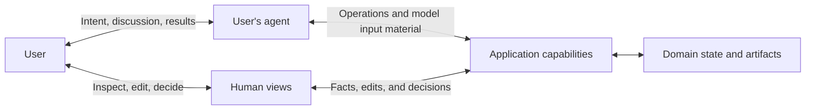

# Foundations

English | [简体中文](../zh-CN/docs/foundations.md)

Users increasingly interact with applications through agents. A user can state a need in natural language without choosing the software that will meet it. The agent may find suitable applications, interpret their capabilities, organize operations, and return results. The user addresses the agent; the agent finds and uses applications on the user's behalf.

In direct use, a user connects a purpose to a product's concepts, operations, and current state. Delegation can transfer part of this work to an agent. The application continues to serve the user's purposes through that agent's judgment and action. The [Agent Native Manifesto](../README.md) begins from this changed relation.

## Design applications first for users' agents

Building a capability does not make it a means the agent will consider. The product may be ready to answer a call while giving the agent no reason to make one. Making a capability exist and making its usefulness recognizable are different parts of application design.

An agent seeking software brings the user's task and constraints. The application must meet it in reachable channels, with a clear account of the work it helps accomplish and the conditions that affect fit. The developer wants the product to be chosen; the user's agent seeks suitable means. The design connects these interests by delivering the help that attracted the agent.

Once chosen, the application needs a complete path through operations, current facts, results, and exceptions. Delegated work should not require the agent to navigate screens, infer meaning from layout, or imitate clicks. These demands make it reconstruct the application's use from a path designed for human operation.

Human-only access steps and reserved decisions remain valid handoffs. They identify who must act, what is needed, and how the caller learns the result. A missing operation cannot become a valid handoff merely by asking a user to perform it for the agent.

## Deliver context with capabilities

An operation can be delegated while the work of understanding it remains with the user. An application may offer a call but leave its conditions unexplained. It may hold state the user must read and repeat, or announce success without making the result available for examination. The operation is handed over; part of the work returns as explanation, checking, and repair.

For a model-based agent, application knowledge informs judgment through the model's input. Descriptions, schemas, Skills, current facts, and tool results become context when included in that input. Stored material needs a usable path into it. A callable operation that cannot be understood or selected from available input is technically present but practically absent from the agent's work.

The application supplies material that accurately describes its capabilities, state, conditions, effects, and limits. The agent selects and organizes it into model input as needed. It need not all be loaded at once. The application does not control the whole input or guarantee the model's judgment; it remains responsible for making its own material clear, current, and accessible. An application that also supplies the user's agent takes on that agent's responsibilities too.

The application already knows much of its own use. Clear guidance makes that knowledge directly usable: where to start, which conditions matter, how to check results, and how to recover from known failures. Agents can organize work on this basis without repeatedly guessing hidden rules. Stable mechanical steps can be performed by the application itself. Important choices remain available for judgment and adaptation to the user's purpose.

A method also carries judgments about what matters. A rule may select the sharpest photographs and exclude the only image of someone the album is meant to remember. It succeeds by its own measure while failing the purpose it was meant to serve. A criterion for choosing the means has begun to decide the end. Guidance must therefore make its assumptions available for judgment. It can offer a way of working; it cannot grant permission or settle the user's purpose. The application still enforces the rules and authority it controls.

## Let work cross application boundaries

In a task that spans applications, an agent can arrange their capabilities around the user's purpose. An application's result can become material for further work.

Each application remains responsible for its own operations and effects. Its value in the wider activity depends on the capabilities and knowledge it contributes, and on whether its results can be used by the authorized caller. A complete workflow or a small operation can each serve the next intended step.

## Delegate action, retain human direction

Delegation changes the user's access to what happens. The agent selects facts, interprets results, and makes some decisions on their behalf. Human views make results and consequences available for inspection, editing, and judgment. They may be rich or complex when the work requires it. A changed paragraph or a selected photograph can express a purpose more precisely than another instruction.

A user may be consulted at every step and still lack the facts needed to judge it. A view may confirm that an edit was saved while the next agent operation receives an older version without notice. Control gains practical force when the user's judgment can alter what follows. Agent operations and human views must use the same domain state. The application makes committed changes available to later operations; the agent includes relevant changes in model input as needed.

The result can change the purpose that guided it. Successful execution does not settle the value of the result. That remains open to judgment in use. Effects already produced become conditions of further action. A new instruction can direct the next step; it cannot, by itself, undo what has already happened.

Delegation does not, by itself, release users from responsibility. An agent may prepare a production deployment correctly while the release approver has yet to decide whether it should happen. Where a decision is reserved for a human, the application must seek it from the responsible user. The agent can prepare the facts and carry out the decision; it cannot supply the user's answer.

Responsibility does not require approval of every step. Users can take responsibility for defined grants of authority and choose how much to delegate. Human approval does not release the application from responsibility for its own rules and effects.

## Interaction model

These are relationships within the same activity. The diagram leaves deployment and storage architecture open.

The user's agent can come from the application or another product. Language understanding can run in that agent.

## From this argument to application design

Agent Native makes the conditions for agent use a responsibility of the product itself. This includes clear guidance and the material needed for model input, direct paths for delegated work, and effective human participation. It does not require a particular protocol or the removal of human interfaces.

Existing tools and API-first products may already supply these conditions. The [application model](application-model.md) develops them into design choices.
