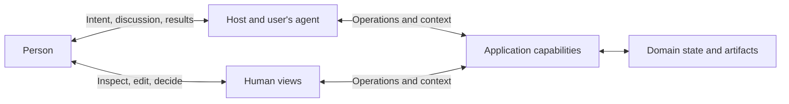

# Foundations

A person sets out to tell a story, prepare a report, or understand a problem. The application offers objects, categories, and permitted actions. To carry out the work, the person must connect the purpose to this particular organization of means. Much of what we call using software consists of this translation.

The application contains decisions made before the present task: which distinctions to preserve, which changes to permit, and what to count as success. These decisions carry useful knowledge into new work. They also carry assumptions about what matters. The person's activity may cross several application boundaries: a report prepared in one becomes material for a decision made elsewhere.

When this work is delegated, the agent connects the person's purpose to application capabilities. The application supplies knowledge of its domain and facts about the work. The agent uses this context to choose and combine operations, then brings results back to the person's judgment. The [Agent Native Manifesto](../README.md) makes a deliberate choice in response: design applications first for agents acting for people.

## Applications supply knowledge as well as capabilities

A request in natural language can state a purpose while leaving many choices open. "Make an album of this trip" leaves the selection and sequence of photographs to be worked out. The agent must give that request a practical form. Useful delegation depends on room for judgment and access to the knowledge required for it.

The application holds part of that knowledge: what its operations mean, which objects exist, what may be changed, and what has happened. When a person must repeatedly describe facts the application already holds, they remain responsible for supplying the agent's view of the work.

Providing the knowledge needed for use is part of providing the capability. Help and manuals can explain concepts and operations. A Skill can describe a method, its assumptions, and the choices that remain open. Current objects and execution feedback supply the facts for this particular use. The form follows the task and environment.

Context has value when it helps the agent choose a relevant capability, understand the current situation, or decide what follows. The application makes its knowledge accessible; the agent selects and interprets it in relation to the person's task.

## Application guidance carries judgments

A method carries judgments about what matters. Sharpness can guide the selection of technically clear photographs. A blurred image may be the only record of someone the album is meant to remember. If a ranking removes that image without allowing its importance to count, a criterion for choosing the means has begun to decide the end.

Application guidance must therefore make the conditions of its advice available for judgment. A recommendation supplies knowledge; it cannot create permission or settle a person's purpose by itself. The application's rules still govern the operations it performs. Its recommended methods remain answerable to the task they are meant to serve.

Seeing the first arrangement can also change what the person wants the album to say. The result reveals choices that were still open in the original request. An application serves this developing purpose by keeping its results available for examination and further work.

## Participation needs practical power

A person's control over delegated work depends on the means to exercise it. Frequent consultation can coexist with little control. A person may be asked to approve every step without the facts needed to judge it. A view may confirm that an edit was saved while subsequent agent operations receive an earlier version without notice. Control becomes effective when the person's judgment can change the course of the work.

Applications therefore need to make results and consequences available to people, and committed human changes available to subsequent agent operations. Those changes become part of the current context from which the agent continues the task. Human views give people a direct way to see, shape, and decide the work that agents also act on. Editing a paragraph or selecting a photograph may express a purpose more precisely than another instruction.

Even a correctly executed task leaves the value of its result open to judgment in use. Effects that have already occurred become conditions of further action. A revised request can direct what happens next; changing an instruction does not by itself undo what has happened.

## Interaction model

These are relationships within the same activity. Hosts and views enable participation; domain state and artifacts are the objects participants use and change. The diagram leaves deployment and storage architecture open.

The user's agent can come from the application or another product. Language understanding can run in that agent or its host. The application remains responsible for the work and effects it accepts, including work it delegates internally.

## From this argument to application design

Existing tools and API-first products can support this relationship. Agent Native makes complete use by agents a primary design concern. The [application model](application-model.md) derives the consequences for capabilities, context, results that travel between applications, and human participation.

The [specification](../spec/core.md) states scoped obligations, and the [evaluation procedure](../spec/evaluation.md) examines contracts and actual use. The [local tool](../examples/local-tool.md) and [reporting service](../examples/reporting-service.md) illustrate how this argument can guide different product designs. Their usefulness must be established through the work people can actually accomplish with them.
