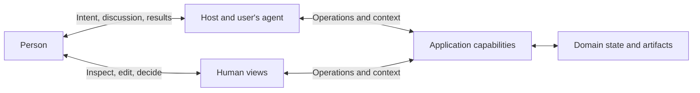

# Foundations

An agent-native application is designed first for agents acting on behalf of people. It provides the capabilities and knowledge needed for that use, while people retain the means to understand and change their work. This is the position developed by the [manifesto](../README.md).

The change concerns the application's direct user. People can express a task in their own language and let an agent connect it to software capabilities. The application takes responsibility for making that connection possible: its capabilities can be found, understood, used, and checked as part of the person's work.

API-first design provides a programmatic boundary. Agent-native design also addresses how an agent learns that boundary, relates it to a task, obtains current facts, and returns results to human judgment.

## Interaction model

These are relationships within one activity. Hosts and views enable participation; state and artifacts are what the participants inspect, use, and change. The arrows describe use and information flow without prescribing a deployment or a shared database.

The user's agent can come from the application or another product. An application may also use agents internally. In each relationship, what matters is who acts for the person, who provides the capability, and who owns the resulting facts and effects.

## People and agents: a task becomes actionable

Natural language lets a person express a purpose before specifying every operation. "Make smaller copies of these images and keep the originals" is meaningful without command names or a complete execution plan. The agent interprets the request, selects capabilities, and uses feedback to decide what follows.

Interpretation introduces choices. Requiring the person to specify every step would return much of the work to them. Allowing every missing detail to become an unexamined assumption could change the task. Useful delegation lets work proceed within what is known and authorized, while making consequential gaps available for clarification or judgment.

The purpose can also develop through use. Seeing sample images may change the desired size or crop. The application needs to support this exchange through understandable capabilities, current context, and inspectable results. Language understanding can run in the user's agent or host; an application can supply its part through a CLI, a function, or another suitable access path.

## Agents and applications: capabilities need meaning

The application contributes both abilities and the knowledge needed to use them. Help, instructions, and Skills can explain concepts and methods. Current objects and operation feedback supply facts about this particular use. Context is valuable when it helps the agent choose and carry out the next relevant action.

Methods have conditions. Selecting sharp photographs can be useful, while a blurred photograph may matter most in a family album. Guidance should reveal its assumptions so that an agent can apply it to the person's task. A recommended method does not acquire authority to redefine that task.

The agent can combine capabilities around work that extends beyond one application. A complete workflow or a small operation can each provide a useful part. Clear meaning and usable results let the next step build on what has already been done. The application contributes its expertise without requiring the whole activity to follow one preset route.

## People and applications: participation changes the work

People can inspect a result, edit a draft, or select a photograph directly. These actions can express judgment more precisely than instructions to an agent. They are part of the same activity and need to affect the facts available to subsequent agent operations.

Shared work therefore needs objects and results that participants can identify and examine. A report of successful execution provides one kind of evidence. Whether the result answers the person's need remains a question for use and judgment. Even correct execution may lead to a changed direction.

Delegation is valuable when it expands what people can accomplish and preserves their ability to understand and influence the work. Human views support inspection, editing, and decisions. The person can choose how much to delegate and where to participate directly.

## From this position to application design

The [application model](application-model.md) turns these relationships into design priorities: organize capabilities for agent use, supply context as part of the product, support composition, and make human participation effective.

The manifesto's **Actionable, Composable, Inspectable, and Correctable** properties describe the resulting application behavior. The [specification](../spec/core.md) defines scoped obligations; the [evaluation procedure](../spec/evaluation.md) tests contracts and actual use. The [local tool](../examples/local-tool.md) and [reporting service](../examples/reporting-service.md) illustrate how the same position leads to different product designs.
