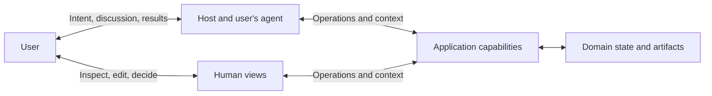

# Foundations

Users increasingly interact with applications through agents. A user states a task in natural language; the agent interprets it, chooses capabilities, organizes operations, and returns results. The user addresses the agent; the agent addresses the application.

In direct use, a user connects a purpose to the application's concepts, operations, and current state. Delegation transfers part of this work of understanding and coordination to the agent. The application continues to serve the user's purposes through an agent's understanding and action.

The [Agent Native Manifesto](../README.md) begins from this changed relation: design applications first for agents acting on behalf of users. The conditions for agent use become a primary concern of application design.

## Applications supply knowledge as well as capabilities

An operation can be delegated while the work of understanding it remains with the user. An application may offer a call but leave its conditions unexplained. It may hold state the user must read and repeat, or announce success without making the result available for examination. In each case, the user must keep interpreting the application for the agent. The operation is handed over; part of the work returns as explanation, checking, and repair.

The application already holds part of what the agent needs to know: what an operation means, under which conditions it can be used, what it changes, and what state the work is in. Providing the knowledge needed for use is part of providing the capability.

Help and manuals can explain concepts and operations. A Skill can set out a method, the assumptions behind it, and the choices left open. Current objects and execution feedback supply the facts of this particular use. Through these forms, the application's knowledge enters the agent's judgment.

Context has value through the judgment and action it supports. The agent selects and interprets this material in relation to the user's task: finding a relevant capability, understanding the situation, deciding what follows.

A method also carries judgments about what matters. A rule may select the sharpest photographs and exclude the only image of someone the album is meant to remember. It succeeds by its own measure while failing the purpose it was meant to serve. A criterion for choosing the means has begun to decide the end. Guidance must therefore make its assumptions available for judgment. It can offer a way of working; it cannot grant permission or settle the user's purpose. The application still enforces the rules and authority it controls.

## Applications contribute to work that extends beyond them

In a task that spans applications, an agent can arrange their capabilities around the user's purpose. Records become a report; the report becomes material for a presentation; the presentation enters a shared decision. What one operation finishes, the next takes up. The activity continues across the divisions between products.

Each application remains responsible for its own operations and effects. Its value in the wider activity depends on the capabilities and knowledge it contributes, and on whether its results can be used by the authorized caller. A complete workflow or a small operation can each serve the next intended step.

## Participation needs practical power

Delegation changes the user's access to what happens. The agent selects facts, interprets results, and makes some decisions on their behalf. The application must make the results and their consequences available for human judgment.

A user may be consulted at every step and still lack the facts needed to judge it. A view may confirm that an edit was saved while the next agent operation receives an older version without notice. Frequent consultation can coexist with little control. Control gains practical force when the user's judgment can alter what follows.

Human views let users see, shape, and decide the same work on which agents act. A changed paragraph or a selected photograph can express a purpose more precisely than another instruction. The application must make the committed change available to the agent as part of the current work.

The result can change the purpose that guided it. Successful execution does not settle the value of the result. That remains open to judgment in use. Effects already produced become conditions of further action. A new instruction can direct the next step; it cannot, by itself, undo what has already happened.

## Delegation does not erase responsibility

Delegation changes who performs the work. It does not, by itself, release users from responsibility. An agent may prepare a production deployment correctly while the release approver has yet to decide whether it should happen. Technical readiness does not make that decision.

Where a decision must be made by a human, the application must seek it from the user responsible for that decision. Participation here is a duty, not merely an opportunity to intervene. The agent can prepare the facts and carry out the decision; it cannot substitute its own choice for the user's answer.

Responsibility does not require approval of every step. Users can take responsibility for defined grants of authority. Where a personal decision is required, the application must provide relevant facts, consequences, and uncertainty, with a real choice to refuse or change the action. Human approval does not release the application from responsibility for its own rules and effects.

## Interaction model

These are relationships within the same activity. Hosts and views enable participation; domain state and artifacts are the objects participants use and change. The diagram leaves deployment and storage architecture open.

The user's agent can come from the application or another product. Language understanding can run in that agent or its host. The application remains responsible for the work and effects it accepts, including work it delegates internally.

## From this argument to application design

An agent can sometimes use an application by adapting to a path built for human operation. Its success may show the agent's ability to adapt, rather than the application's support for this use. Agent Native makes the conditions for agent use a responsibility of the product itself.

Existing tools and API-first products may already supply these conditions. The [application model](application-model.md) develops this position into concrete design choices.

The [specification](../spec/core.md) states scoped obligations, and the [evaluation procedure](../spec/evaluation.md) examines contracts and actual use. The [local tool](../examples/local-tool.md) and [reporting service](../examples/reporting-service.md) illustrate how this argument can guide different product designs. Their usefulness must be established through the work users can actually accomplish with them.
