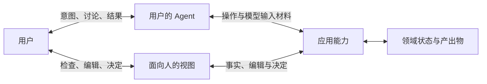

# 基础论述

[English](../../docs/foundations.md) | 简体中文

用户越来越多地通过 Agent 使用应用。用户可以用自然语言提出需要，而不先选择满足需要的软件。Agent 可以寻找合适的应用、理解其能力、组织操作并返回结果。用户面向 Agent，Agent 则代表用户寻找和使用应用。

直接使用产品时，用户把自己的目的与产品的概念、操作和当前状态联系起来。委托可以把一部分工作交给 Agent。应用通过 Agent 的判断与行动，继续服务于用户的目的。[Agent Native 宣言](../README.md)从这一关系变化出发。

## 应用首先为用户的 Agent 而设计

能力已经存在，不意味着 Agent 会把它纳入考虑。产品可能已准备好响应调用，却没有给 Agent 发起调用的理由。让能力存在，与让它的用处被识别，是应用设计的不同部分。

Agent 寻找软件时，带着用户的任务与约束。应用应在可触达的渠道中，清楚说明能帮助完成的工作及影响适用性的条件。开发者希望产品被选择，用户的 Agent 则寻找合适的手段。设计通过交付吸引 Agent 前来的帮助，连接这两种利益。

产品被选中后，应提供贯通操作、当前事实、结果和异常处理的完整路径。可委托的工作不应要求 Agent 浏览页面、从布局推断含义或模拟点击。这些要求迫使它从为人设计的操作路径中重新推断应用的用法。

必须由人完成的访问步骤和保留给人的决定，仍可通过交接完成。交接应明确谁来行动、需要什么，以及调用方如何得知结果。仅仅要求用户替 Agent 执行，不能把缺失的操作变成合理的交接。

## 上下文与能力一同交付

操作可以交给 Agent，理解操作的工作却仍留给用户。应用可能提供调用，却不说明适用条件；可能持有状态，却需要用户读取后再转述；也可能宣布成功，却不提供可检查的结果。操作被委托出去，一部分工作又以解释、检查和修复的形式返回。

对于基于模型的 Agent，应用知识通过模型输入参与判断。描述、schema、Skill、当前事实和工具结果，只有被纳入模型输入才成为上下文。存储的材料需要有可用的路径进入其中。一个可调用但无法从现有输入中被理解和选择的操作，在技术上存在，在 Agent 的实际工作中却等于不存在。

应用提供准确描述自身能力、状态、条件、效果和限制的材料。Agent 按需选择并组织这些材料，形成模型输入，不必一次性全部加载。应用不控制整份输入，也不保证模型的判断，但仍负责让自身材料清楚、当前且可获取。应用同时提供用户的 Agent 时，也承担该 Agent 的相应责任。

应用已经掌握自身用法中的许多知识。清晰的指引让这些知识可以直接采用：从哪里开始、哪些条件重要、如何检查结果，以及怎样从已知失败中恢复。Agent 可以在此基础上组织工作，无须反复猜测隐藏规则。稳定的机械步骤可以由应用自身执行。重要选择仍应留给判断，并能根据用户目的调整。

方法也包含对“什么重要”的判断。一条规则可能选出最清晰的照片，却排除了相册本想纪念的某个人仅有的一张照片。它满足了自己的标准，却违背了本应服务的目的。选择手段的标准开始替人决定目的。因此，指导必须把自己的假设交出来接受判断。它可以提供工作方法，却不能授予权限或替用户确定目的。应用仍须执行其负责的规则与权限约束。

## 让工作跨越应用边界

在跨应用任务中，Agent 可以围绕用户的目的组织各应用的能力。一个应用的结果可以成为后续工作的材料。

每个应用仍对自己的操作和效果负责。它在更大活动中的价值，取决于提供的能力和知识，以及获准的调用方能否使用其结果。完整工作流和小型操作，都可以服务于预期的下一步。

## 委托行动，保留人的主导

委托改变了用户了解实际进展的方式。Agent 选择事实、解释结果，并代表用户作出部分决定。面向人的视图让结果与后果可供检查、编辑和判断。工作需要时，视图可以丰富甚至复杂。改写一段文字或选定一张照片，可能比再发一条指令更准确地表达目的。

用户可能每一步都被征询，却仍缺少判断所需的事实。视图可能确认编辑已保存，而 Agent 的下一次操作却悄无声息地拿到旧版本。只有当用户的判断能够改变后续工作时，控制才有实际力量。Agent 的操作和人的视图必须使用同一领域状态。应用让后续操作能够获取已提交的修改；Agent 按需将相关修改纳入模型输入。

结果可以改变引导它产生的目的。执行成功不能决定结果的价值；价值仍有待在使用中判断。已经产生的效果成为后续行动的条件。新指令可以指导下一步，却不能仅凭自身撤销已经发生的事。

委托不会自动解除用户的责任。Agent 可能已经正确准备好生产部署，但发布审批者尚未决定是否执行。对于保留给人的决定，应用必须向负责的用户取得。Agent 可以准备事实、执行决定，却不能代替用户给出答案。

承担责任不意味着批准每一步。用户可以对范围明确的授权负责，并选择委托的程度。人的批准也不会解除应用对自身规则和效果的责任。

## 交互模型

这些关系存在于同一活动中。图中不限定部署和存储架构。

用户的 Agent 可以来自该应用，也可以来自其他产品。语言理解可以由该 Agent 承担。

## 从论证到应用设计

Agent Native 将 Agent 使用所需的条件确立为产品自身的责任。这包括清晰的指引与模型输入所需的材料、可委托工作的直接使用路径，以及有效的人类参与。这不要求特定协议，也不要求移除人的界面。

现有工具和 API 优先的产品可能已经提供了这些条件。[应用模型](application-model.md)将其展开为设计选择。
