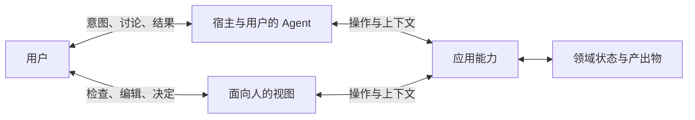

# 基础论述

[English](../../docs/foundations.md) | 简体中文

用户越来越多地通过 Agent 使用应用。用户可以用自然语言提出需要，而不先选择满足需要的软件。Agent 可以寻找合适的应用、理解其能力、组织操作并返回结果。用户面向 Agent，Agent 则代表用户寻找和使用应用。

直接使用产品时，用户判断产品能提供什么，并把自己的目的与产品的概念、操作和当前状态联系起来。委托可以把一部分工作交给 Agent，包括寻找合适的产品。应用通过 Agent 的判断与行动，继续服务于用户的目的。

[Agent Native 宣言](../README.md)从这一关系变化出发：优先为代表用户行动的 Agent 设计应用。

## 应用必须吸引用户的 Agent 的注意

能力已经存在，不意味着 Agent 会把它纳入考虑。产品可能已准备好响应调用，却没有给 Agent 发起调用的理由。让能力存在，与让它的用处被识别，是应用设计的不同部分。

Agent 代表用户寻找软件时，带着用户的任务与约束。应用应在 Agent 能够触达的渠道中，清楚说明产品能提供什么帮助。它不能只呈现内部结构，把推断产品价值的工作留给 Agent。

报告应用可以罗列命令和协议，也可以说明如何把分散的客户反馈转化为一份来源可核查、内容可修改的草稿。前者描述产品如何组织，后者把能力与用户的工作联系起来。调用细节仍然必要，但 Agent 不应读完接口手册之后，才知道产品为何可能有用。

开发者希望产品被选择，用户的 Agent 则为任务寻找合适的手段。设计应连接这两种利益：在产品确实能帮上忙时，让 Agent 识别它，并交付吸引 Agent 前来的帮助。

## 应用既提供能力，也提供知识

操作可以交给 Agent，理解操作的工作却仍留给用户。应用可能提供调用，却不说明适用条件；可能持有状态，却需要用户读取后再转述；也可能宣布成功，却不提供可检查的结果。每种情况下，用户都要不断为 Agent 解释应用。操作被委托出去，一部分工作又以解释、检查和修复的形式返回。

应用已经掌握 Agent 所需的一部分知识：操作意味着什么、在什么条件下可用、会改变什么，以及工作处于什么状态。提供使用能力所需的知识，本就是提供能力的一部分。

上下文的价值在于它所支持的判断与行动。Agent 依据用户的任务选择和解释上下文。

方法也包含对“什么重要”的判断。一条规则可能选出最清晰的照片，却排除了相册本想纪念的某个人仅有的一张照片。它满足了自己的标准，却违背了本应服务的目的。选择手段的标准开始替人决定目的。因此，指导必须把自己的假设交出来接受判断。它可以提供工作方法，却不能授予权限或替用户确定目的。应用仍须执行其负责的规则与权限约束。

## 应用参与超出自身边界的工作

在跨应用任务中，Agent 可以围绕用户的目的组织各应用的能力。一个应用的结果可以成为后续工作的材料。

每个应用仍对自己的操作和效果负责。它在更大活动中的价值，取决于提供的能力和知识，以及获准的调用方能否使用其结果。完整工作流和小型操作，都可以服务于预期的下一步。

## 参与需要实际的影响力

委托改变了用户了解实际进展的方式。Agent 选择事实、解释结果，并代表用户作出部分决定。应用必须让结果及其后果可供人判断。

用户可能每一步都被征询，却仍缺少判断所需的事实。视图可能确认编辑已保存，而 Agent 的下一次操作却悄无声息地拿到旧版本。频繁征询可以与缺乏控制并存。只有当用户的判断能够改变后续工作时，控制才有实际力量。

供人使用的视图，让用户能够查看、塑造和决定 Agent 正在处理的同一项工作。改写一段文字或选定一张照片，可能比再发一条指令更准确地表达目的。应用必须让已提交的修改成为 Agent 可获取的当前工作的一部分。

结果可以改变引导它产生的目的。执行成功不能决定结果的价值；价值仍有待在使用中判断。已经产生的效果成为后续行动的条件。新指令可以指导下一步，却不能仅凭自身撤销已经发生的事。

## 委托不消除责任

委托改变了由谁执行工作，却不会自动解除用户的责任。Agent 可能已经正确准备好生产部署，但发布审批者尚未决定是否执行。技术就绪不能替人作出这一决定。

必须由人作出的决定，应用必须向对此负责的用户取得。此时，参与是一项责任，而不只是一次介入机会。Agent 可以准备事实、执行决定，却不能用自己的选择代替用户的回答。

承担责任不意味着批准每一步。用户可以对范围明确的授权负责。人的批准也不会解除应用对自身规则和效果的责任。

## 交互模型

这些关系存在于同一活动中。图中不限定部署和存储架构。

用户的 Agent 可以来自该应用，也可以来自其他产品。语言理解可以由该 Agent 或其宿主承担。

## 从论证到应用设计

Agent 有时可以适应原本为人设计的操作路径，从而使用应用。成功可能体现的是 Agent 的适应能力，而非应用对此类使用方式的支持。Agent Native 将 Agent 使用所需的条件确立为产品自身的责任。

现有工具和 API 优先的产品可能已经提供了这些条件。[应用模型](application-model.md)将其展开为设计选择。
